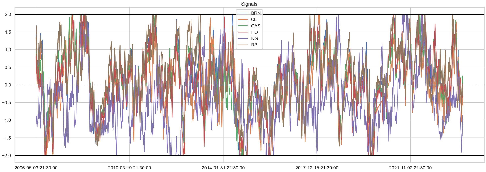
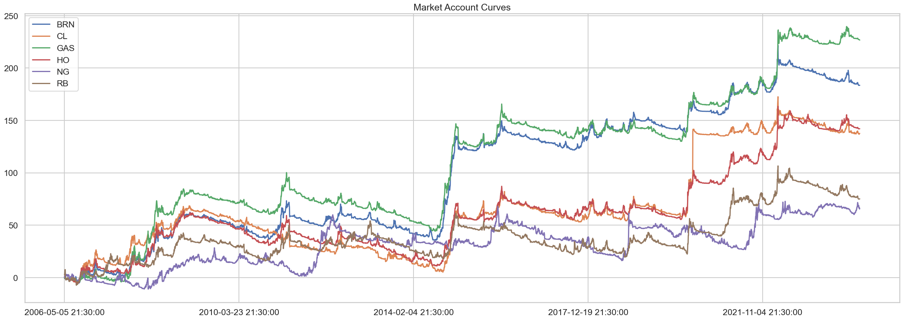
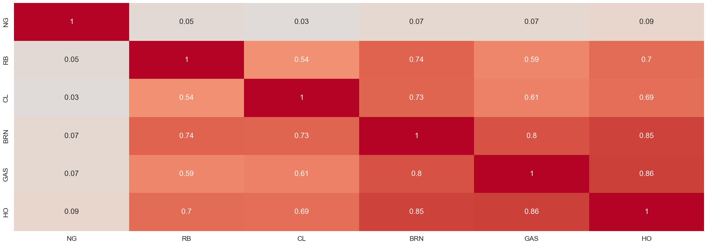

# Quicktest

Quicktest is a lightweight backtesting engine for quickly prototyping trading strategies.

Instructions: Simply input signal and price dataframes and execute the report method in a Jupyter notebook for a lightning fast backtest. Below is a simple example of a price momentum strategy backtest on energy future markets which you may find in the examples folder

# Backtest
```python
from quicktest import Quicktest
import pandas as pd
```


```python
from quicktest import Quicktest
import pandas as pd
signals = pd.read_csv("momentum_signal.csv", index_col=0)
prices = pd.read_csv("adjusted_price.csv", index_col=0)

backtest = Quicktest(signals, prices)
backtest.report()
```


## Stats


<table border="1" class="dataframe">
  <thead>
    <tr style="text-align: right;">
      <th></th>
      <th>sharpe</th>
      <th>holding_period</th>
    </tr>
  </thead>
  <tbody>
    <tr>
      <th>Stats</th>
      <td>0.62</td>
      <td>25.56</td>
    </tr>
  </tbody>
</table>


## Account Curve


    

    


## Signals


    

    


## Market Stats


    

    


    

    


## Market Correlations


    

    


## Tilt vs Timing


<table border="1" class="dataframe">
  <thead>
    <tr style="text-align: right;">
      <th></th>
      <th>backtest</th>
      <th>tilt</th>
      <th>timing</th>
    </tr>
  </thead>
  <tbody>
    <tr>
      <th>sharpes</th>
      <td>0.62</td>
      <td>0.13</td>
      <td>0.62</td>
    </tr>
  </tbody>
</table>


    

    


## Long vs short


<table border="1" class="dataframe">
  <thead>
    <tr style="text-align: right;">
      <th></th>
      <th>long_sharpe</th>
      <th>short_sharpe</th>
      <th>percentage_long</th>
    </tr>
  </thead>
  <tbody>
    <tr>
      <th>Stats</th>
      <td>0.31</td>
      <td>0.56</td>
      <td>47.0</td>
    </tr>
  </tbody>
</table>


    

    


## Momentum Comparison


<table border="1" class="dataframe">
  <thead>
    <tr style="text-align: right;">
      <th></th>
      <th>backtest_sharpe</th>
      <th>momentum_sharpe</th>
      <th>correlation</th>
      <th>appraisal</th>
    </tr>
  </thead>
  <tbody>
    <tr>
      <th>Momentum Stats</th>
      <td>0.62</td>
      <td>0.62</td>
      <td>1.0</td>
      <td>0.0</td>
    </tr>
  </tbody>
</table>


    

    


## Lead-Lag Plot


    

    


```python

```
